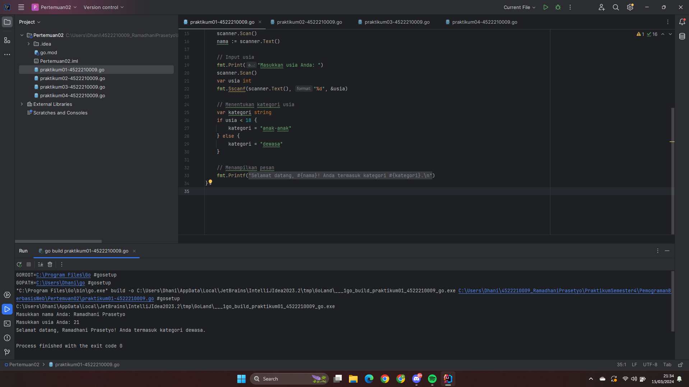
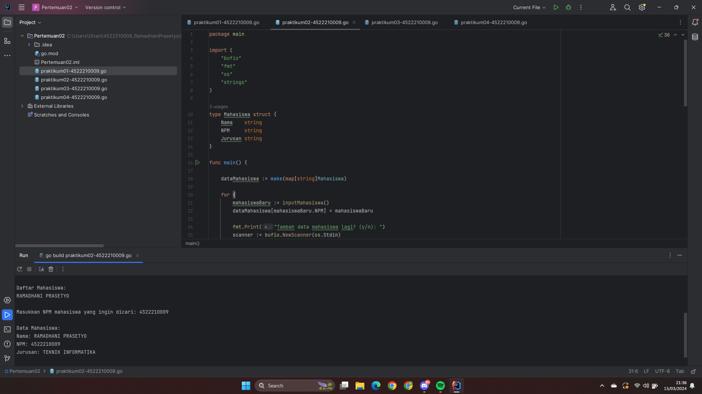
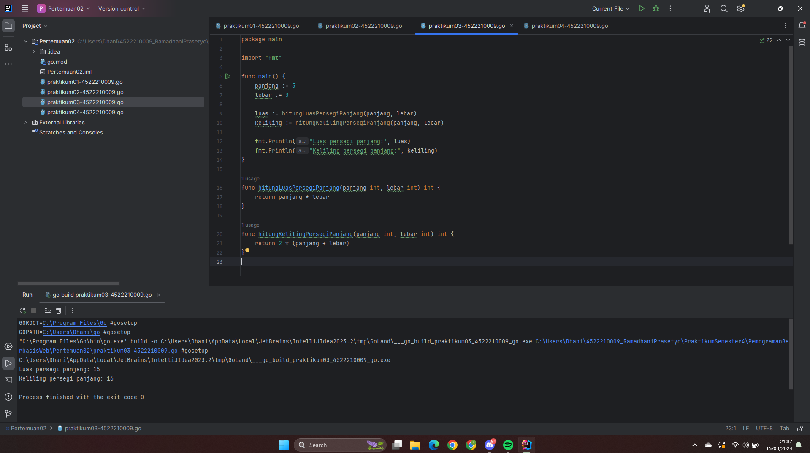
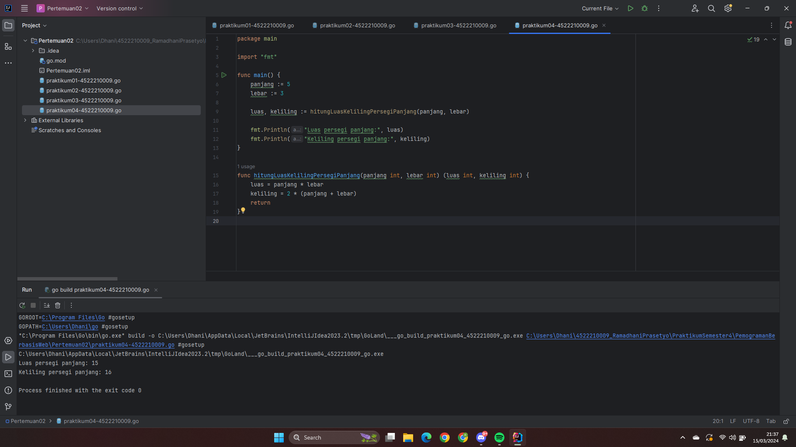

# Tugas Praktikum Ke-2 Pemograman Berbasis Web

## Nama: RAMADHANI PRASETYO
## NIM: 4522210009

Selamat datang di repositori Tugas Praktikum Ke-2 Pemrograman Berbasis Web! Repositori ini berisi tugas-tugas yang telah dikerjakan dalam rangka mempelajari pemrograman berbasis web mengunakan bahasa Go (Golang).

---

## Tugas 01 
### Screenshot

---

## Tugas 02 
### Screenshot

---

## Tugas 03 
### Screenshot

### Penjelasan Program
Program di atas bertujuan untuk menghitung luas dan keliling dari sebuah persegi panjang. Dua variabel untuk panjang dan lebar persegi panjang dideklarasikan, kemudian dua fungsi digunakan untuk menghitung luas dan keliling. Hasil perhitungan dicetak menggunakan fungsi `fmt.Println()`.

---

## Tugas 04 
### Screenshot

### Penjelasan Program
Program di atas juga menghitung luas dan keliling persegi panjang. Namun, pada program ini, digunakan satu fungsi yang mengembalikan dua nilai sekaligus, yaitu luas dan keliling persegi panjang. Hasil perhitungan dicetak menggunakan fungsi `fmt.Println()`.

---

## Tugas 05
### Perbedaan antara Tugas 03 dan Tugas 04!
Perbedaan antara Tugas 03 dan Tugas 04 terletak pada cara pengorganisasian fungsi-fungsi yang digunakan untuk menghitung luas dan keliling persegi panjang. Pada Tugas 03, fungsi untuk menghitung luas dan keliling persegi panjang dipisahkan menjadi dua fungsi terpisah, sedangkan pada Tugas 04, keduanya digabung menjadi satu fungsi yang mengembalikan dua nilai sekaligus.

---

Terimakasih !!
